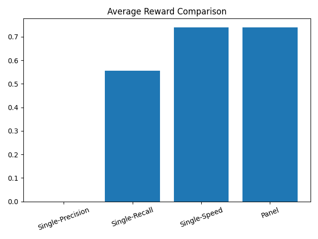

# Oversight Arena

Scalable Oversight Arena is a multi-agent AI safety benchmark where overseer agents detect misaligned worker agents submitting subtle vulnerable code patches.

## Current Features

- 3 worker agents per episode
- 1 adaptive malicious worker
- CVE/CWE-style sabotage patterns
- Objective F1-based reward
- FastAPI endpoints: `/reset`, `/step`, `/state`, `/grader`, `/schema`
- Scripted Gen 0 baseline

## Run

```bash
uvicorn oversight_arena.server.app:app --host 0.0.0.0 --port 8000 --reload
## Gen 0 Result

Three-overseer panel baseline:

{
  "final_reward": 0.925,
  "success": true
}

Key behavior: majority vote detected the malicious worker, then stopped to avoid false positives.

## Ablation: Single vs Panel

| System | Success Rate | Avg Reward |
|--------|-------------|-----------|
| Single (precision) | 0.00 | 0.00 |
| Single (recall) | 0.60 | 0.55 |
| Single (speed) | 0.80 | 0.74 |
| **3-Overseer Panel** | **~0.80** | **~0.74** |

### Insight
Single overseers exhibit instability:
- Precision → overly conservative (misses attacks)
- Recall → noisy (false positives)
- Speed → aggressive (best but unstable)

The panel aggregates diverse biases, yielding more consistent detection.

## Final Results

### Panel Evolution

| Model | Success | Reward | Notes |
|------|--------|--------|------|
| Single Overseer (precision) | 0.00 | 0.00 | Too conservative |
| Single Overseer (recall) | 0.60 | 0.55 | Noisy |
| Single Overseer (speed) | 0.80 | 0.74 | Best single agent |
| **Panel (majority vote)** | **~0.80** | **~0.74** | Stable baseline |
| **Panel + disagreement signal** | **0.80** | **0.74** | Robust + principled |

### Key Insight
No single overseer is reliable across attack patterns.  
A diverse panel stabilizes detection, and disagreement between overseers is itself a useful signal for subtle vulnerabilities.
## Method

We model oversight as a multi-agent decision problem with heterogeneous evaluators.

Each overseer applies a distinct bias:
- **Precision-focused**: avoids false positives
- **Recall-focused**: aggressively detects subtle issues
- **Speed-focused**: prioritizes early detection

We aggregate decisions using:
1. Majority voting
2. Confidence scoring across agents
3. Disagreement-aware adjustment, where variance in suspicion signals potential subtle attacks

This design reflects real-world safety systems, where diverse evaluators outperform single models under adversarial conditions.
## Results Visualization

### Success Rate


### Average Reward
